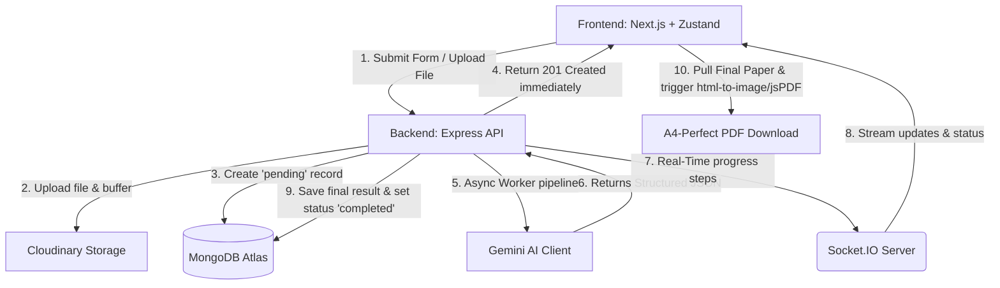

# 🎓 VedaAI — AI Assessment & Question Paper Creator

[](https://nextjs.org/)
[](https://www.typescriptlang.org/)
[](https://tailwindcss.com/)
[](https://nodejs.org/)
[](https://expressjs.com/)
[](https://www.mongodb.com/)
[](https://socket.io/)
[](https://aistudio.google.com/)

**VedaAI** is a premium, high-fidelity Full-Stack Web Application built for modern educators to design, generate, and customize AI-driven school-exam question papers. It seamlessly combines highly structured form inputs (supporting optional file uploads for contextual reference) with the **Google Gemini API** to generate rich, syllabus-aligned assessments in real-time. 

With interactive background processing, live progress tracking via **WebSockets (Socket.IO)**, and an elegant, school-exam-styled output interface featuring **A4-perfect PDF export**, VedaAI delivers an elite experience inspired directly by professional Figma designs.

 **Live Deployment**: [VedaAI Live Deploy link](https://ai-assessment-creator-livid.vercel.app/)
 **Demo Video**: [VedaAI Demo Video](https://drive.google.com/file/d/1J5aqnz-u72jMXUSjzSagWaOjyAJO9vko/view?usp=sharing)

---

## System Architecture

VedaAI is designed as a modular, full-stack monorepo featuring high separation of concerns:



### Key Architectural Flow:
1. **Instant Feedback**: When a teacher submits the generation form, the server initializes the assessment in a `pending` state and returns a `201` status immediately, shielding the frontend from browser connection timeouts during LLM inference.
2. **WebSocket Synchronization**: The frontend connects to the socket gateway and automatically joins a room mapped to the `assignmentId`. As the server steps through file reading, AI prompt creation, parsing, and database saving, it broadcasts progress messages to keep the user engaged.
3. **Structured Response Guarantees**: Rather than feeding raw text responses to the viewport, VedaAI commands Gemini using specific strict JSON schemas, translating the content into structured object components (Sections, MCQ Options, difficulty tags, marks, and detailed answer keys with pedagogical explanations).

---

## Key Features & Highlights

### 1. Highly-Validated Assignment Designer
* Fully structured wizard UI containing validation rules to prevent empty inputs, negative question counts, or invalid point allocations.
* Support for uploading study materials (PDFs/Text) processed through **Multer** and securely cached via **Cloudinary**, serving as an explicit contextual anchor for Gemini's prompt generator.
* Granular configuration for due dates, difficulty distribution, specific question types (MCQ, Short Answers, Long Answers, True/False), and custom guidelines.

### 2. Real-Time Progress Streamer
* Background workers handle AI generations asynchronously, avoiding bottleneck blocks on HTTP cycles.
* Real-time socket rooms stream specific statuses: `Reading document...`, `Planning assignment layout...`, `Generating content...`, `Saving new assignment...`.
* The client animates an interactive progress bar using an asymptotic loading function that elegantly transitions to `100%` on `job:completed`.

### 3. Structured School-Exam Visualizer
* Generates realistic student registration slots (Name, Roll Number, Class/Section).
* Groups questions perfectly by dynamic Sections (e.g., *Section A: Multiple Choice Questions*, *Section B: Short Answer Questions*).
* Features visual badges indicating difficulty levels (`Easy` in green, `Moderate` in yellow, `Hard` in red) alongside dedicated points allocation.
* Complete educational **Answer Key and Explanation Accordion** at the end of the paper, detailing the correct answers alongside pedagogical rationales.

### 4. High-Fidelity A4 PDF Generator
To solve typical browser printing failures (where dynamic Tailwind v4 elements are clipped, page dimensions are misaligned, or background tag overlays fail to render), VedaAI utilizes a custom visual rasterization pipeline:
1. **Targeted Reference**: Binds a React `useRef` hook directly onto the "Master Paper Container."
2. **Lossless Compilation**: Utilizes `html-to-image` to compile the visual container into a high-density, high-quality PNG data URL.
3. **Canvas Proportional Scaling**: Instantiates a standard `jsPDF` canvas in `a4` portrait mode ($210mm \times 297mm$).
4. **Perfect Page Fit**: Automatically calculates the aspect ratio and proportionally maps the high-resolution raster image on the printable canvas. This guarantees that your PDF exactly mirrors the high-end design, completely safe from CSS layout breaks or clipping.

---

## Tech Stack

### Frontend Directory (`/frontend`)
* **Framework**: Next.js 15+ (App Router)
* **Language**: TypeScript
* **State Management**: Zustand
* **Styling**: Tailwind CSS v4 (Glassmorphic layouts, harmonious dark/light color variables)
* **Real-time Client**: Socket.IO-Client
* **PDF Engine**: `html-to-image` + `jsPDF`

### Backend Directory (`/backend`)
* **Environment**: Node.js & Express (TypeScript)
* **Database**: MongoDB (via Mongoose)
* **Storage Gateway**: Cloudinary API (for caching uploaded text & document guides)
* **Generative Engine**: Google Gemini API (`@google/generative-ai`)
* **Real-time Gateway**: Socket.IO
* **File Parser**: Multer

### Shared Directory (`/shared`)
* Contains shared definitions, structures, and schemas (`index.ts`) kept in sync between the client components and server controllers.

---

## Installation & Local Setup

Get VedaAI up and running in your local workspace:

### Prerequisites
* **Node.js** (v18.x or v20.x recommended)
* **npm** (v9.x or higher)
* **MongoDB**: Local database instance or MongoDB Atlas Connection String
* **Gemini API Key**: Secure key from [Google AI Studio](https://aistudio.google.com/)
* **Cloudinary Account**: Free Cloudinary credentials for handling file references (Optional fallback)

---

### Step 1: Clone and Install Workspace Dependencies

At the root directory of the project, install both frontend and backend configurations simultaneously:

```bash
# Install dependencies for both Next.js and Express
npm run install:all
```

---

### Step 2: Configure the Backend Environment

1. Navigate to `/backend`:
   ```bash
   cd backend
   ```
2. Duplicate the environment template file:
   ```bash
   cp .env.example .env
   ```
3. Populate your `.env` configuration:
   ```env
   PORT=5000
   NODE_ENV=development
   FRONTEND_URL=http://localhost:3000

   # Database Connection
   MONGO_URI=mongodb+srv://<user>:<password>@cluster0.mongodb.net/vedaai?retryWrites=true&w=majority

   # Google Gemini AI Access Key
   GEMINI_API_KEY=AIzaSy...

   # Cloudinary Access (Required for PDF/Text context reference extraction)
   CLOUDINARY_CLOUD_NAME=your_cloud_name
   CLOUDINARY_API_KEY=your_api_key
   CLOUDINARY_API_SECRET=your_api_secret
   ```

4. Boot the backend server in development mode:
   ```bash
   npm run dev
   ```
   *Your API gateway will launch successfully at `http://localhost:5000`.*

---

### Step 3: Configure the Frontend Environment

1. In a new terminal window, navigate to `/frontend`:
   ```bash
   cd ../frontend
   ```
2. Create your local environment variables file:
   ```bash
   touch .env.local
   ```
3. Insert your api pointers:
   ```env
   NEXT_PUBLIC_API_URL=http://localhost:5000
   BACKEND_URL=http://localhost:5000
   ```

4. Boot up your Next.js workspace:
   ```bash
   npm run dev
   ```
   *The Next.js development server is live at [http://localhost:3000](http://localhost:3000).*

---

## Seeding & Test Data

If you'd like to seed dummy assessments into MongoDB for immediate inspection without generating new ones, we have included a seeding script.

Navigate to `/backend` and run:
```bash
npm run seed
```
This populates MongoDB with structured question papers spanning Multiple Subjects, Question types, and structured Answer Keys.

---

## Future Enhancements
* **BullMQ queues & Redis Caching**: Scaling background tasks with standalone workers using Redis for strict job isolation.
* **Interactive Editor**: Allows teachers to click, edit, delete, or regenerate individual questions on the fly before exporting.
* **Student Mode**: Allow students to join a room, attempt the exam, and have their answers graded automatically using Gemini.
